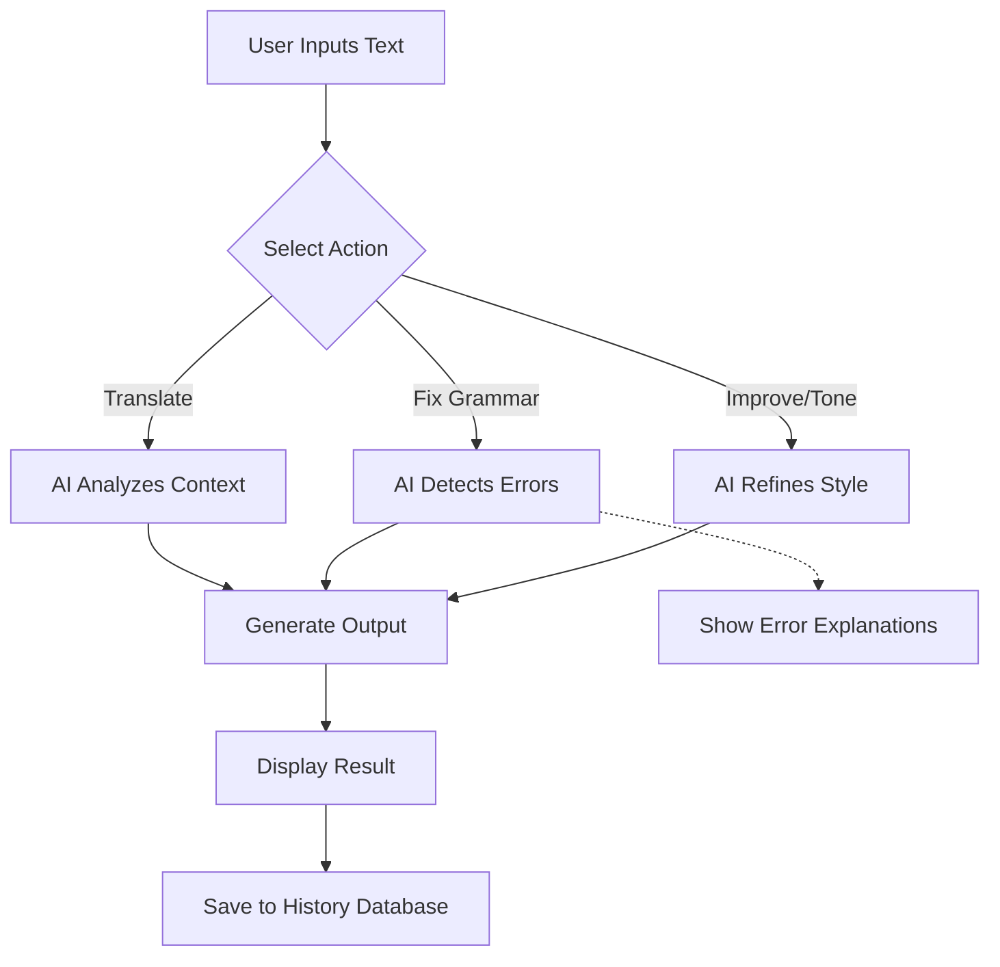

# AI Translator & Grammar Fixer - Project Plan 🚀

## 1. Executive Summary
The **AI Khmer ↔ English Translator & Grammar Fixer** is an intelligent web application designed to help users translate text accurately, fix grammar mistakes, and elevate their writing style. By integrating AI models like Google Gemini, it acts as a highly personalized translation engine and writing coach. This tool bridges language gaps and polishes professional communication with tailored tone adjustments.

---

## 2. Core Features & Benefits

| Feature | Description | Benefit |
| :--- | :--- | :--- |
| 🌐 **Translation (KH ↔ EN)** | Fast, context-aware translations between Khmer and English. | Ensures natural-sounding translations that preserve the original meaning. |
| 🛠️ **Grammar Fixer** | Automatically detects and corrects grammar, punctuation, and spelling mistakes. | Highlights errors like a "code linter" and fixes them efficiently. |
| ✍️ **Improve Formal Writing** | Refines casual writing into polished, professional prose. | Elevates vocabulary and structure for business or academic emails/reports. |
| 🎭 **Tone Adjustment** | Dynamically rewrites the input to match a desired mood (e.g., Friendly, Formal, Authoritative, Polite, Casual). | Gives users flexibility to communicate effectively across any social setting. |
| 💾 **History Database** | Saves history of past translations and corrections. | Allows users to review previous work and track their language improvement. |

---

## 3. Workflow (`The User Journey`)

1. **Input (បញ្ចូល):** The user types, pastes, or writes sentences they want to translate or fix.
2. **Process (ដំណើរការ AI):** The AI backend evaluates the input and processes it based on the selected mode: Translate, Fix Grammar, or Adjust Tone.
3. **Output (បង្ហាញ):** The application displays the processed text along with a detailed explanation of any grammar corrections.
4. **Save (រក្សាទុក):** The session is saved into the database for future reference.

---

## 4. UI/UX Structure (Web App Layout)

The web application should feature a clean, intuitive, and modern split-screen design to maximize usability and productivity.

### 🧩 Layout Components
- **Sidebar (Menu):** Navigation for different tools:
  - 🌍 Translate
  - ✅ Fix Grammar
  - 📈 Improve Writing
  - 🎭 Tone Adjustment
  - 🕒 History
- **Main Workspace:** A responsive split-screen setup:
  - **Left Panel:** Input Text Area.
  - **Right Panel:** Output Text Area (with easy "Copy to Clipboard").
- **Controls & Actions:**
  - Dropdown Menus: Select Target Language, Select Desired Tone.
  - Action Buttons: `Translate`, `Fix`, `Improve`.
- **Explanation Section:** A dedicated block below or alongside the output specifically for explaining grammar corrections to help the user learn.

---

## 5. Technology Stack

To ensure scalability, performance, and modern design, the application will be built using the following technologies:

### 🎨 Frontend (Client-side)
- **HTML5 & CSS3:** For semantic structure and custom styling.
- **JavaScript (Vanilla / jQuery):** For asynchronous requests and dynamic UI updates without page reloads.
- **Bootstrap:** For a responsive, mobile-friendly grid system and pre-built modern UI components.

### ⚙️ Backend (Server-side)
- **Python with Django:** A robust framework to build a RESTful API to handle client requests securely.
- **AI Integration:** Google Gemini API for powerful NLP tasks (Translation, Error Detection, Tone generation).

### 🗄️ Database
- **SQLite:** A lightweight, built-in SQL database for storing user translation history and sessions.

---

## 6. Implementation Roadmap

### Phase 1: Project Setup & Design (Setup Phase)
- Set up the Django project environment and configure SQLite.
- Design the wireframes and finalize the UI color scheme and typography.
- Set up the GitHub repository and project structure.

### Phase 2: Frontend Development (UI/UX Phase)
- Build the `index.html` structure with the Sidebar and Split-screen workspace.
- Style the UI using CSS and Bootstrap (implement responsive design).
- Create static mockups for the Output block and Error Explanation section.

### Phase 3: Backend & AI Integration (API Phase)
- Create Django REST API endpoints for handling text requests.
- Integrate the Google Gemini API using Python.
- Write specific API prompts for each core feature:
  - Accurate Khmer/English translation logic.
  - Grammar error identification and explanation extraction.
  - Tone manipulation and rewriting logic.

### Phase 4: Full-Stack Connection (Integration Phase)
- Connect the Frontend JavaScript to the Django endpoints using `fetch` or `AJAX`.
- Implement dynamic loading states (spinners) while the AI API is processing.
- Build the History feature, ensuring input/output pairs are saved to the SQLite database.

### Phase 5: Testing & Deployment (Release Phase)
- Conduct thorough manual testing for edge cases (e.g., very long text, special characters).
- Polish the UI with small animations and hover effects to ensure a premium feel.
- Deploy the application to a cloud provider (e.g., Render, PythonAnywhere, Heroku).
